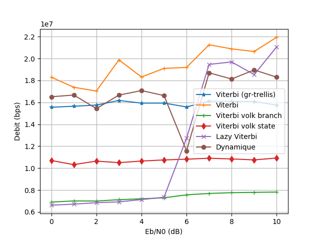
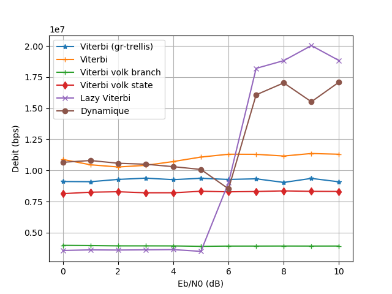
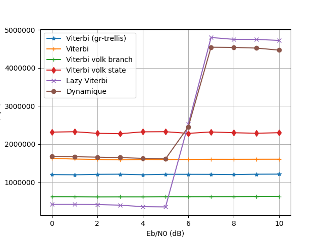
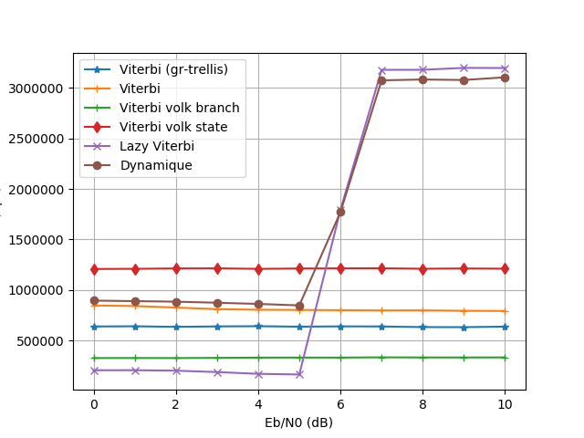

# GNURadio implementation of the Lazy Viterbi algorithm.

*Now with two Volk-accelerated implementations!*

This module contains a three blocks, which are drop-in replacement for the Viterbi
block of gr-trellis:
* Lazy Viterbi: implements the Viterbi algorithm for decoding or equalization in the way described
in Feldman, Jon & Abou-Faycal, Ibrahim & Frigo, Matteo. (2002).
A Fast Maximum-Likelihood Decoder for Convolutional Codes. Vehicular Technology Conference, 1988, IEEE 38th.
10.1109/VETECF.2002.1040367. 
This implementation provides a significant speedup at moderate SNRs, but is slower
at low SNR.
* Viterbi: implements the classical Viterbi algorithm.
This implementation is better-suited than Lazy Viterbi for low SNRs.
* Dynamic Viterbi: Switch between the two implementations mentionned above,
depending on SNR.
* Viterbi Volk (branch parallelization): implements the classical Viterbi algorithm, but uses Volk to enable parallell processing of branches leading to each state (each state is treated sequentially).
This implementation should be more suited to trellis having more transitions between branches than states (like turbo-Hadamrd / turbo-FSK types of trellis).
* Viterbi Volk (state parallelization): implements the classical Viterbi algorithm, but uses Volk to enable parallell processing of states (Add-Compare-Select is done on multiple states at the same time).
This implementation should be more suited to trellis having states than transitions between states (it is the case of most error correcting codes).

One GRC example is provided in the examples/ directory:
* `simple.grc` simple example showing how each decoder should be use in a typical flowgraph. You will have to populate the variable `base_dir`, and put the full path to the source folder of `gr-lazyviterbi` (for example: `/usr/local/src/gr-lazyviterbi`).

There are also two python scripts :
* `ber_vs_ebn0_75_awgn.py` lets you compare the BER of this algorithm
and the gr-trellis's implementation of the classical Viterbi algorithm for a
transmission AWGN channel with the (7,5) convolutional code (there
should be a slight difference of performance du to metrics quantization from our
implementation) ;
* `bitrate_vs_ebn0.py` compare the speed of this algorithm and the gr-trellis's
implementation of the classical Viterbi algorithm for a transmission AWGN
channel with the (229,159) convolutional code.
The convolutional code used in this script can easily be changed by supplying its
treillis in a FSM file (see gr-trellis documentation), to see what kind of speedup
can be expected for a particular use case.

There is no best implementation. Performance depends on the trellis, the SNR of the transmission, the processor in your computer.
Bellow is bitrate comparisons for some trellis, using a computer equiped with an Intel core i5 775 (see `examples/bitrate_vs_ebn0.py` for details on simulation parameters).

(5,7) Convolutional code.

(15,13) Recursive Systematic Convolutional (RSC) code.

(171,133) Convolutional code.

(229,159) Convolutional code.

